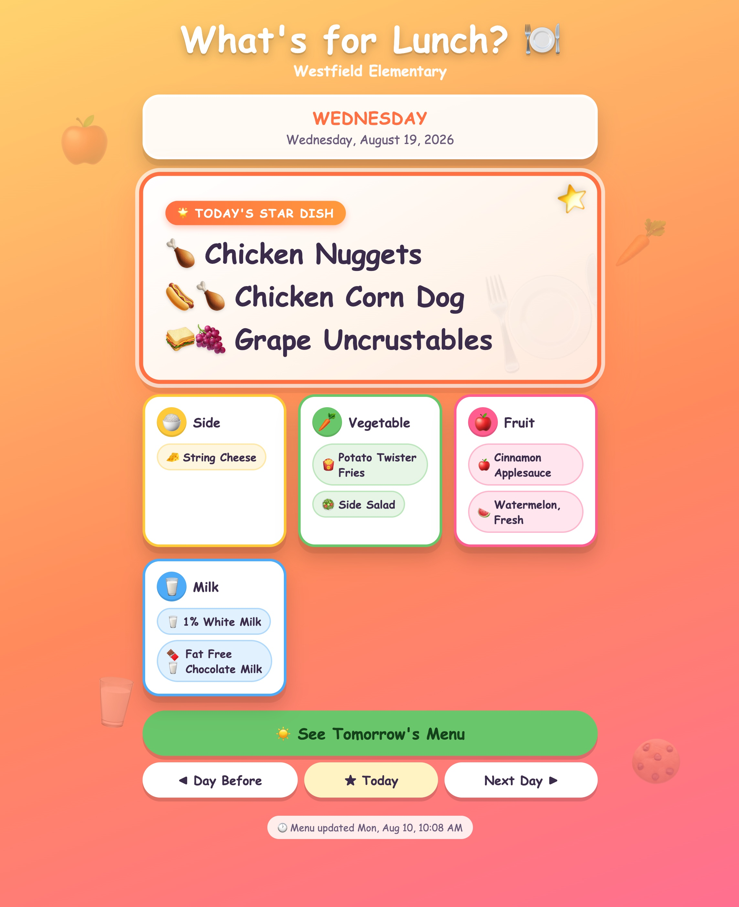
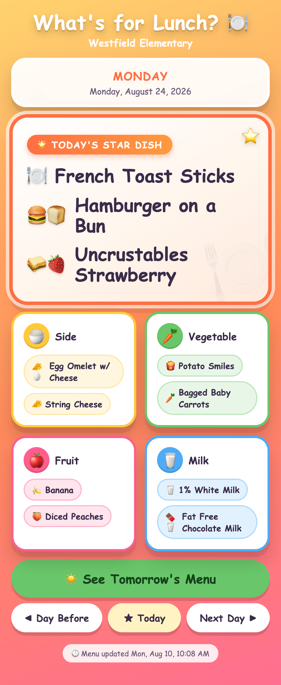
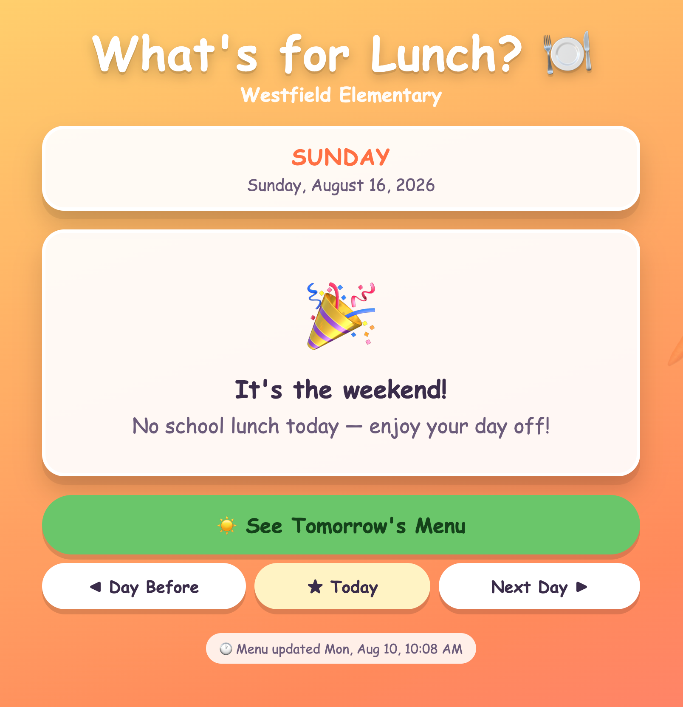
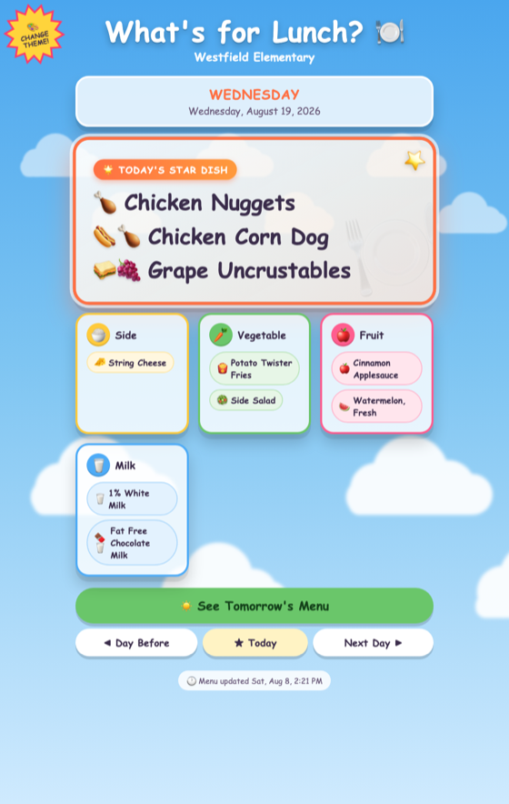
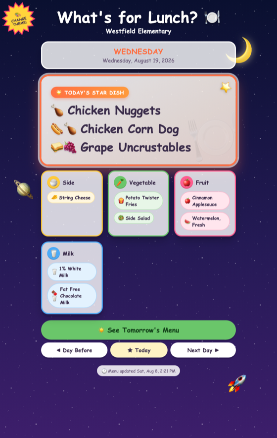
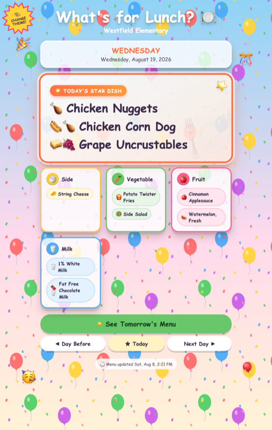
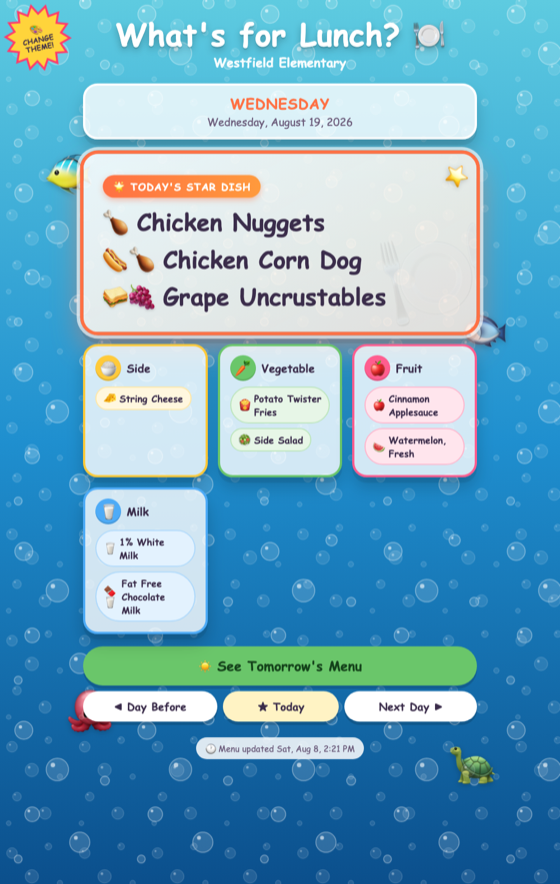
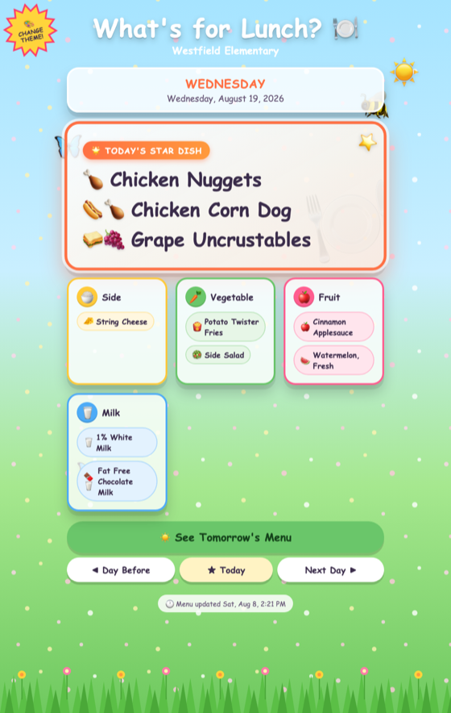
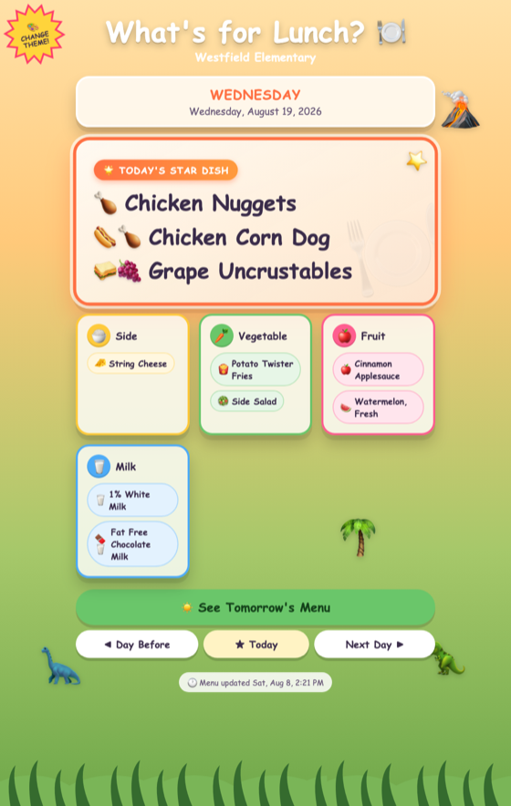
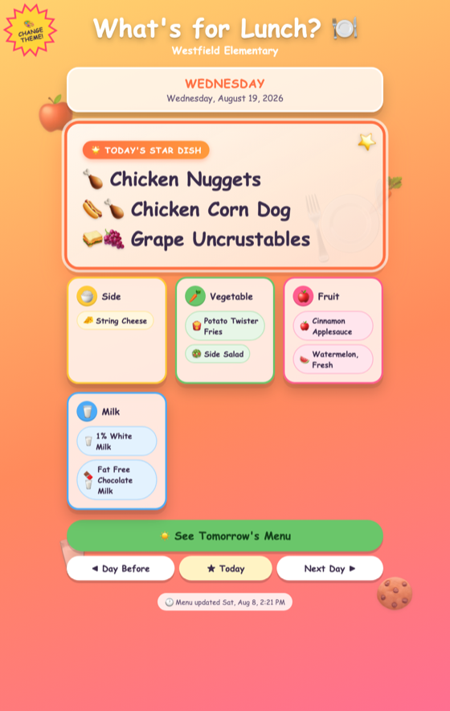

# 🍽️ MenuGrabber

A fun, colorful, kid-friendly web dashboard that shows **Westfield Elementary**
(Alpine School District) school **lunch** — today's food, plus a button to peek at
tomorrow's. Live at **http://rprnt.com/menugrabber**.

A daily cron job scrapes the district's menu into a local `menu.json`; the static
web page reads that file. No database, no backend app, no runtime dependencies on
the web server beyond the once-a-day script.

## Requirements

To **host** it (a small Linux box is plenty):

- **Apache** — or any web server that can serve static files
- **cron** — runs the daily menu refresh
- **bash**, **curl**, **jq**, and **GNU `date`** — used by the scraper
  (`sudo apt-get install -y curl jq`; the rest ship with a standard Linux install)
- Outbound HTTPS access to `api.linqconnect.com`

For **local development** (optional):

- **python3** (`python3 -m http.server`) or any static file server
- the scraper tools above, if you want to regenerate `menu.json` yourself

## Features

- 🍱 Today's lunch at a glance, with the **main dish** as a glowing "star" hero card
- ☀️ One-tap **Tomorrow's Menu**, plus Day-Before / Today / Next-Day browsing
- 🔗 Deep-link to any date via `?day=YYYY-MM-DD` (or `MM-DD-YYYY`)
- 🍗 Auto-matched food emojis (chicken, corn dog, cheese, milk, fruit, …)
- 🎉 Playful tap effects and a confetti cannon, kid-tested silliness
- 🎨 Seven switchable background themes (cloudy sky · outer space · balloon party · under the sea · sunny meadow · dino world · candy/food) via a starburst "Change Theme" sticker in the top-left corner
- 📅 "Last updated" badge, friendly weekend / no-school fallback
- 🪶 100% static front-end — vanilla HTML/CSS/JS, **no build step, no external CDNs**
- ♿ Responsive (phone → wall tablet) and honors `prefers-reduced-motion`

## Screenshots

The dashboard on a wide screen — glowing "star" main dish, color-coded sides, and
floating food peeking through the translucent cards:



| On a phone (stacks to two columns) | Weekends & no-school days |
|:----------------------------------:|:-------------------------:|
|  |  |

### Theme library

Tap the corner **🎨 Change Theme** sticker to cycle backgrounds — your choice is
saved and restored on your next visit (until you change it again).

<table>
  <tr>
    <td align="center"><br><b>Cloudy Sky</b><br><sub>default</sub></td>
    <td align="center"><br><b>Outer Space</b></td>
    <td align="center"><br><b>Balloon Party</b></td>
    <td align="center"><br><b>Under the Sea</b></td>
  </tr>
  <tr>
    <td align="center"><br><b>Sunny Meadow</b></td>
    <td align="center"><br><b>Dino World</b></td>
    <td align="center"><br><b>Candy Fun</b><br><sub>original</sub></td>
    <td></td>
  </tr>
</table>

The repo root **is** the web root — clone it straight into your docroot and it serves.

```
MenuGrabber/                 # ← clone this into your docroot; it IS the site
├── index.html               # the dashboard (served at /menugrabber/)
├── styles.css
├── app.js
├── data/menu.json           # written by the scraper (kept out of git conflicts, see Deploy)
├── scraper/grab_menu.sh     # daily: fetch LinqConnect API → data/menu.json
├── deploy/
│   ├── menugrabber.conf      # Apache config
│   └── menugrabber.cron      # daily cron entry
└── screenshots/             # images used by this README
```

## How it works

1. **`scraper/grab_menu.sh`** calls LinqConnect's public menu API for a 21-day
   window (today → +21 days), keeps the **Lunch** session, drops condiments, and
   writes a tidy `data/menu.json` keyed by date. It writes atomically, so a failed
   or empty fetch never blanks the live page.
2. The **static page** (`index.html`) `app.js` fetches `data/menu.json`, shows the
   selected day's lunch (defaulting to today). A big **☀️ See Tomorrow's Menu**
   button jumps straight to tomorrow, and a stepper row (**◀ Day Before / ★ Today /
   Next Day ▶**) lets kids browse any day further out. A "last updated" badge shows
   when the data was refreshed.

Each food item also gets fun auto-matched emojis (🍗 chicken, 🌭 corn dog, 🧀 cheese,
🥛 milk, …), and the **Main Dish** is shown as a glowing "star" hero card.

**Just for fun (all purely playful — nothing navigates or saves):**
- Tap a whole **card** → a random silly effect: a glowing beam racing around the
  border, a rainbow shimmer, a confetti or cloud burst, a wobble, or a sparkle pop.
- Tap a **food item** → a little confetti pop at your finger and it toggles to a
  darker "picked" shade. **Picking** an item also fires a full-screen confetti cannon
  from both bottom corners that arcs up and rains down (un-picking doesn't).
- All the big motion respects `prefers-reduced-motion` (the confetti cannon is skipped
  for users who ask for reduced motion).

The API needs no login, but its firewall rejects plain requests — the scraper sends
browser-like headers (`User-Agent`, `Origin`, `Referer`) to get JSON back.

### Link to a specific day
Add a `?day=` (or `?date=`) query parameter to open the page on a specific date.
Both formats are accepted — the 4-digit year can lead or trail:

```
http://rprnt.com/menugrabber/?day=2026-08-19     # YYYY-MM-DD
http://rprnt.com/menugrabber/?day=08-19-2026     # MM-DD-YYYY
```

An invalid or missing value simply opens on today. If the requested day is outside
the 21-day scraped window it still displays (with a friendly "no lunch" card), and
the nav buttons let you browse around it.

### Themes
The **🎨 Try a New Theme** starburst sticker in the top-left corner cycles the
background theme and remembers your choice in `localStorage`. First-time visitors
see the default, an animated flat-bottomed **cloudy sky** (`THEMES[0]`). The others,
in cycle order: an **outer space** starfield with a moon, planet, rocket & randomized
shooting stars, a **balloon party** with rising balloons & confetti, an **under the
sea** scene with rising bubbles & drifting fish, a **sunny meadow** with falling
petals, a flower-dotted grass line & fluttering butterflies, a **dino world** with
rolling hills, ferns, a volcano & roaming dinosaurs, and finally the original
**candy/food** theme with floating snacks. Adding a new theme is two small steps:

1. In `styles.css`, add a `[data-theme="your-id"]` block: set the `body`
   background, optionally reuse the two `.sky` layers (`::before`/`::after`) for a
   repeating/animated pattern, and fill the four `.decor` slots via
   `[data-theme="your-id"] .dN::before { content: "🙂"; }` (see `candy`/`space`).
2. In `app.js`, add `{ id: "your-id", label: "Your Label", color: "#hex" }` to
   the `THEMES` array (the `color` sets the mobile browser chrome via `theme-color`).

## Deploy with Git

The repo root is the web root, so deploying = cloning it into your docroot. Below,
**`<site>`** is that path (this project uses `/var/www/rprnt/menugrabber`, served at
`http://rprnt.com/menugrabber`). Update, forever after, is just `git pull`.

### 1. One-time setup on the server
```bash
# prerequisites (Debian/Ubuntu; RHEL/CentOS: use yum)
sudo apt-get install -y git curl jq

# clone the repo INTO the docroot (the folder must not already exist)
sudo git clone https://github.com/roperev/menugrabber.git /var/www/rprnt/menugrabber
cd /var/www/rprnt/menugrabber

# the scraper rewrites data/menu.json daily; tell git to ignore those local
# writes so they never block a future `git pull`
git update-index --skip-worktree data/menu.json

# make the scraper executable (in case the clone didn't preserve the bit)
chmod +x scraper/grab_menu.sh

# let whoever runs cron write the data dir (skip if cron runs as root)
sudo chown -R www-data:www-data data

# seed today's data now so the page isn't empty before the first cron run
./scraper/grab_menu.sh
jq '.days | keys' data/menu.json      # sanity check
```
> During summer / breaks the API returns no days — that's expected. To eyeball a
> real week: `START_DATE=09-08-2025 ./scraper/grab_menu.sh`

### 2. Apache
If `/var/www/rprnt` is already `rprnt.com`'s DocumentRoot, `/menugrabber` serves as a
subfolder automatically. Install the provided conf for the correct `.json` MIME type,
caching, and to keep git/source files private:
```bash
sudo cp deploy/menugrabber.conf /etc/apache2/conf-available/menugrabber.conf
sudo a2enconf menugrabber
sudo a2enmod headers          # for the cache-control header (optional)
sudo systemctl reload apache2
```

### 3. Cron (daily refresh)
The line format differs by location (this trips people up):

- **Root's crontab** (`sudo crontab -e`) — **no user field**:
  ```cron
  7 5 * * * /var/www/rprnt/menugrabber/scraper/grab_menu.sh >> /var/log/menugrabber.log 2>&1
  ```
  (Adding `www-data` here makes cron run it as a command → `www-data: not found`.)
  Running as root is fine — the scraper writes `menu.json` world-readable (0644).
- **System `/etc/cron.d`** — *requires* a user field; use `deploy/menugrabber.cron`:
  ```bash
  sudo cp deploy/menugrabber.cron /etc/cron.d/menugrabber && sudo chmod 644 /etc/cron.d/menugrabber
  ```

Then visit **http://rprnt.com/menugrabber** 🎉

### Updating later
```bash
cd /var/www/rprnt/menugrabber && git pull
```
That's it — no file copying. (`data/menu.json` stays put thanks to the `skip-worktree`
above; the cron job keeps refreshing it.)

## Configuration

The scraper reads these environment variables (all have sensible defaults baked in):

| Variable        | Default                                    | Purpose                        |
|-----------------|--------------------------------------------|--------------------------------|
| `BUILDING_ID`   | Westfield Elementary GUID                  | Which school                   |
| `DISTRICT_ID`   | Alpine School District GUID                | Which district                 |
| `SCHOOL_NAME`   | `Westfield Elementary`                     | Shown in the page header       |
| `DISTRICT_NAME` | `Alpine School District`                   | Stored in the JSON             |
| `OUT_FILE`      | `<site>/data/menu.json`| Where to write output          |
| `DAYS_AHEAD`    | `21`                                       | Size of the fetch window       |
| `START_DATE`    | (today)                                     | `MM-DD-YYYY` override, testing |

### Point it at a different school
Every Alpine school is available. List them (with their building IDs) via the
public identifier endpoint used by LinqConnect:

```bash
curl -s -A 'Mozilla/5.0' -H 'Origin: https://linqconnect.com' -H 'Referer: https://linqconnect.com/' \
  'https://api.linqconnect.com/api/FamilyMenuIdentifier?identifier=TFCNC9' | jq '.Buildings'
```
Set `BUILDING_ID` (and `SCHOOL_NAME`) accordingly.

## Local development

```bash
# 1. Seed a realistic sample (summer returns nothing, so use a school week):
OUT_FILE=data/menu.json START_DATE=09-08-2025 ./scraper/grab_menu.sh

# 2. Serve the static site from the repo root:
python3 -m http.server 8000
# open http://localhost:8000
```
Because the sample is dated in the past, the page will open on today (a "no lunch"
card) — step back with **◀ Day Before** to reach the seeded week, or re-seed with a
`START_DATE` near today.

## Troubleshooting

| Symptom                              | Fix                                                                 |
|--------------------------------------|---------------------------------------------------------------------|
| Scraper prints `HTTP 403`            | The API needs the browser headers — they're already in the script; check outbound network / proxy. |
| Scraper prints `HTTP 404 District not found` | `DISTRICT_ID` is wrong/empty. |
| `jq: command not found`              | `sudo apt-get install jq`                                           |
| Page shows "Couldn't load the menu"  | `data/menu.json` missing or not served — run the scraper; check the Apache `.json` MIME type. |
| `data/menu.json` returns **403 Forbidden** | Apache (`www-data`) can't read the file/dir. Fix perms: `sudo chmod 755 <site> <site>/data` and `sudo chmod 644 <site>/data/menu.json`. The scraper now writes 644 automatically. |
| Scraper: `permission denied` / `cannot create` on write | The user running it can't write `OUT_FILE`. Run as a user who owns the `data/` dir (or `sudo`), or `sudo chown -R www-data:www-data <site>/data`. |
| Page shows "No school lunch"         | Correct on weekends/holidays/summer, or if today is outside the fetched window. |
| `menu.json` is empty `{"days":{}}`   | It's a non-school period — the API genuinely has no menu. |

## Data source

LinqConnect public API (no auth, no keys):
`GET https://api.linqconnect.com/api/FamilyMenu?buildingId=…&districtId=…&startDate=MM-DD-YYYY&endDate=MM-DD-YYYY`
with headers `Origin: https://linqconnect.com` and `Referer: https://linqconnect.com/`.
Original public page: <https://linqconnect.com/public/menu/TFCNC9>

The building/district IDs and the `TFCNC9` menu code in this repo are the same public
identifiers LinqConnect exposes in its own page URLs — there are no credentials, tokens,
or private data anywhere in this project.

## Disclaimer

An unofficial, personal hobby project. Not affiliated with, endorsed by, or supported
by any school district or LinqConnect / TITAN. It reads a publicly accessible menu
endpoint once a day for personal use; please be respectful of the source and don't
hammer it. Menu data belongs to its respective owners.
